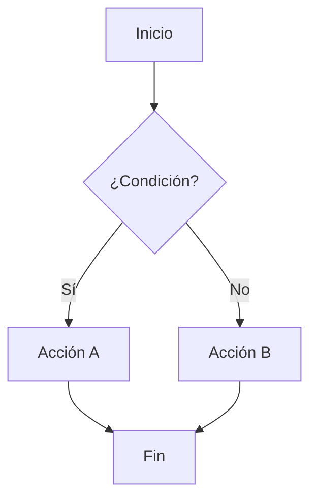
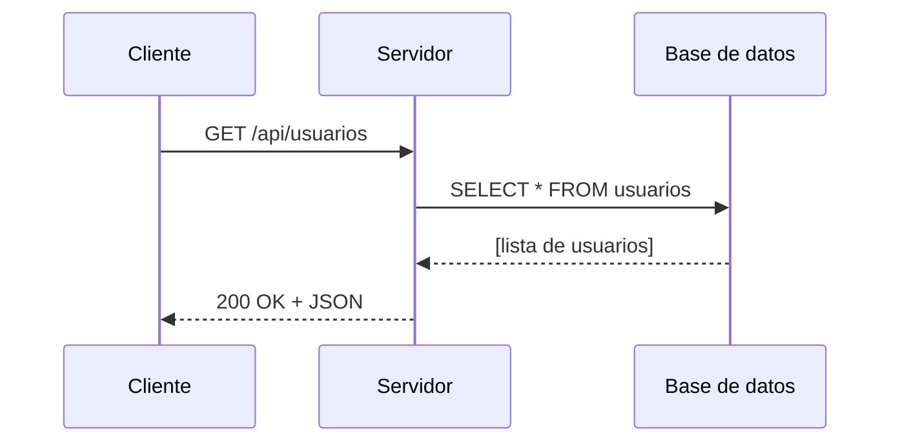
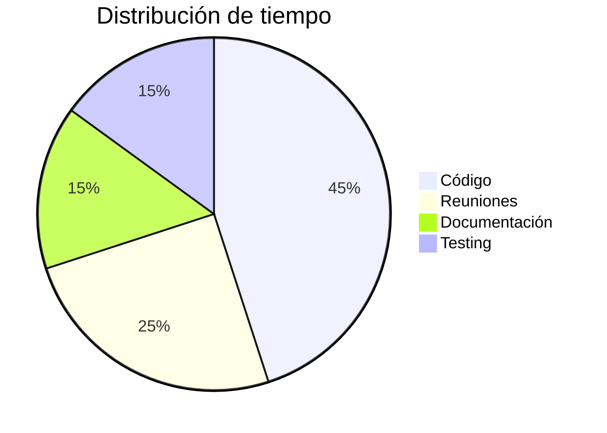

# 07 — Markdown Extendido (GFM y otros)

> GitHub Flavored Markdown (GFM) es una extensión de Markdown estándar usada en GitHub, GitLab y muchas otras plataformas. Incluye características adicionales muy útiles.

---

## Listas de Tareas

```markdown
## Mis pendientes de hoy

- [x] Revisar el correo
- [x] Reunión de equipo (9:00 AM)
- [ ] Terminar el informe
- [ ] Actualizar dependencias del proyecto
- [ ] Code review de PR #42
```

**Resultado:**

- [x] Revisar el correo
- [x] Reunión de equipo (9:00 AM)
- [ ] Terminar el informe
- [ ] Actualizar dependencias del proyecto
- [ ] Code review de PR #42

En GitHub, estas casillas son interactivas y se pueden marcar directamente en la interfaz.

---

## Tablas (GFM)

Las tablas son una extensión de GFM (no son Markdown estándar):

```markdown
| Lenguaje | Paradigma | Tipado |
|----------|-----------|--------|
| JavaScript | Multi-paradigma | Dinámico |
| Python | Multi-paradigma | Dinámico |
| Java | OOP | Estático |
| Haskell | Funcional | Estático |
```

*(Ver el archivo de [tablas](05-tablas.md) para ejemplos completos)*

---

## Tachado

```markdown
~~Este texto está tachado~~
El precio era ~~$100~~ ahora $75.
```

**Resultado:**

~~Este texto está tachado~~  
El precio era ~~$100~~ ahora $75.

---

## Emojis

En plataformas como GitHub puedes usar emojis con `:nombre:`:

```markdown
¡Hola! :wave:
Buen trabajo :+1: :clap:
Cuidado :warning: :exclamation:
Favorito :heart: :star:
Tecnología :computer: :rocket: :gear:
```

**Resultado en GitHub:**

¡Hola! 👋  
Buen trabajo 👍 👏  
Favorito ❤️ ⭐  
Tecnología 💻 🚀 ⚙️

### Emojis Unicode directos (funcionan en todas partes)

```markdown
✅ Completado
❌ Error
⚠️ Advertencia
💡 Idea / Tip
📝 Nota
🚀 Deploy / Lanzamiento
🐛 Bug
🔧 Fix / Configuración
📦 Paquete / Release
🔒 Seguridad
```

---

## Menciones y Referencias (GitHub)

```markdown
Mencionar a un usuario: @usuario
Mencionar a un equipo: @org/equipo

Referenciar un issue: #123
Referenciar una PR: #456
Referenciar en otro repo: usuario/repo#789

Referenciar un commit: a5c3785
```

---

## Auto-linking

GitHub convierte automáticamente ciertas referencias en enlaces:
- URLs: `https://github.com` → clickeable
- Issues: `#123` → enlace al issue
- Commits: hash SHA → enlace al commit

---

## Notas al Pie (Footnotes)

Disponible en GitHub y algunos parsers:

```markdown
Aquí hay una referencia[^1] y otra[^nota].

[^1]: Esta es la primera nota al pie.
[^nota]: Esta es la nota llamada "nota".
```

**Resultado:**

Aquí hay una referencia[^1] y otra[^nota].

[^1]: Primera nota al pie.
[^nota]: Segunda nota al pie.

---

## Texto Subíndice y Superíndice

Disponible en algunos parsers (no GFM estándar):

```markdown
H~2~O    (subíndice)
E=mc^2^  (superíndice)
```

Con HTML (funciona en más lugares):

```markdown
H<sub>2</sub>O
E=mc<sup>2</sup>
```

**Resultado:**

H<sub>2</sub>O  
E=mc<sup>2</sup>

---

## Definición de Términos (algunos parsers)

```markdown
Markdown
:   Lenguaje de marcado ligero para formatear texto plano.

HTML
:   HyperText Markup Language, lenguaje estándar para páginas web.
```

---

## Bloques de Detalles / Acordeones (con HTML)

Funciona en GitHub Markdown:

```html
<details>
  <summary>🔽 Haz clic para expandir</summary>
  
  Aquí va el contenido oculto.
  
  - Puede incluir listas
  - Y otros **elementos** de Markdown
  
</details>
```

**Resultado:**

<details>
  <summary>🔽 Haz clic para expandir</summary>
  
  Aquí va el contenido oculto.
  
  - Puede incluir listas
  - Y otros **elementos** de Markdown
  
</details>

---

## Matemáticas (GitHub, Obsidian, etc.)

GitHub soporta LaTeX con `$` para inline y `$$` para bloques:

```markdown
Inline: $E = mc^2$

Bloque:
$$
\frac{-b \pm \sqrt{b^2 - 4ac}}{2a}
$$
```

$$
\frac{-b \pm \sqrt{b^2 - 4ac}}{2a}
$$

---

## Diagramas con Mermaid (GitHub)

GitHub renderiza diagramas Mermaid directamente:

````markdown

````

````markdown

````

````markdown

````

---

[← Volver al README](../README.md) | [← Anterior](06-citas-separadores.md) | [Siguiente: Trucos Avanzados →](08-trucos-avanzados.md)
